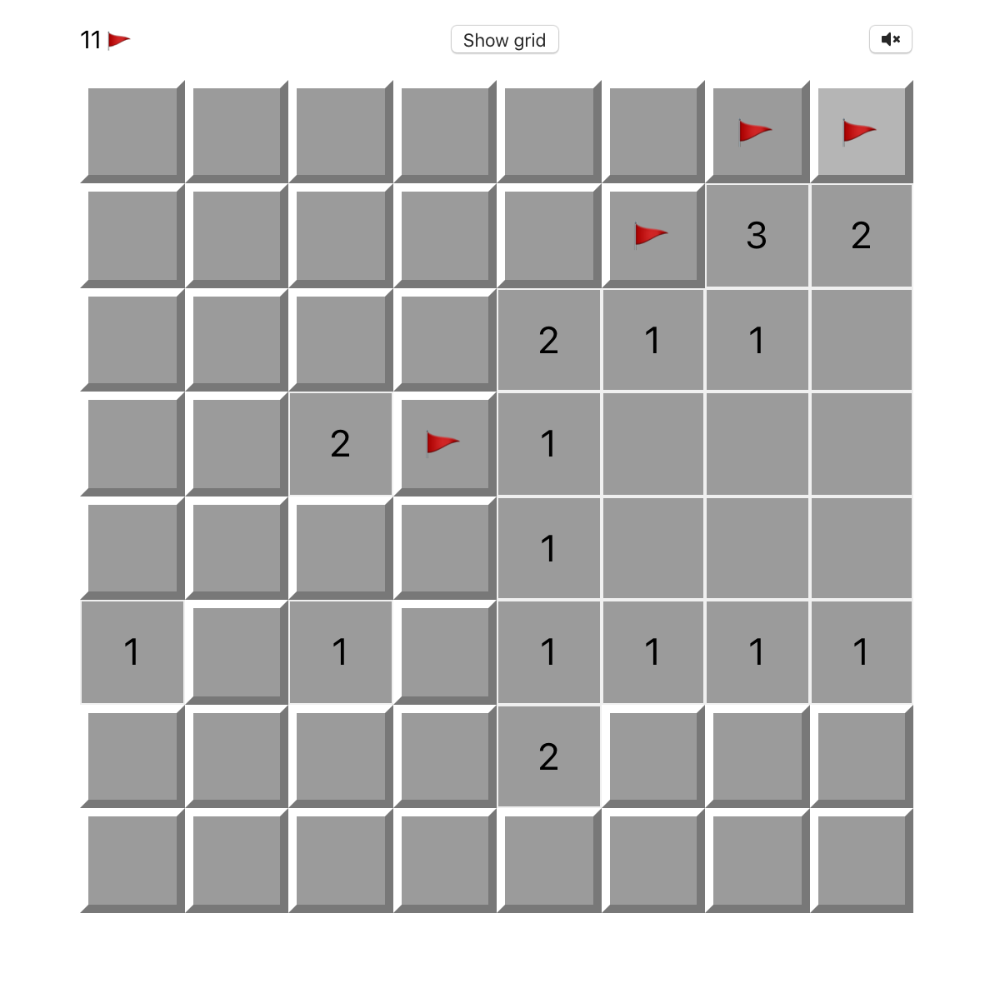

# CheerzOrBoom

A complete minesweeper game built with React (hooks)

[Play Now!](https://admiring-davinci-96f9e2.netlify.com/)



---

### TODO

- [x] Custom game board and three different major difficulty.
- [ ] Counting Time.
- [x] Set flags.
- [x] Quick mode and mode switch.
- [ ] Settings save in cookie.
- [ ] Multiplayer
- [ ] Replay

### How to Play
Seriously !?

### Build
git clone this project, then.
```bash
cd cheerzorboom
npm install
npm start
```
Head to [localhost:3000](localhost:3000).

#### `Blocks`:
An immutable Map represent the whole game board blocks, with `BlockRecord` as keys and `Block` as values.

### Contribute
Issues, PRs, and all the advise and discussion are very welcome !
